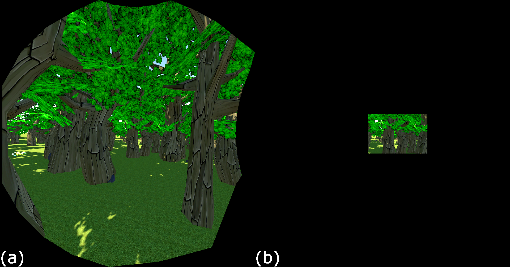
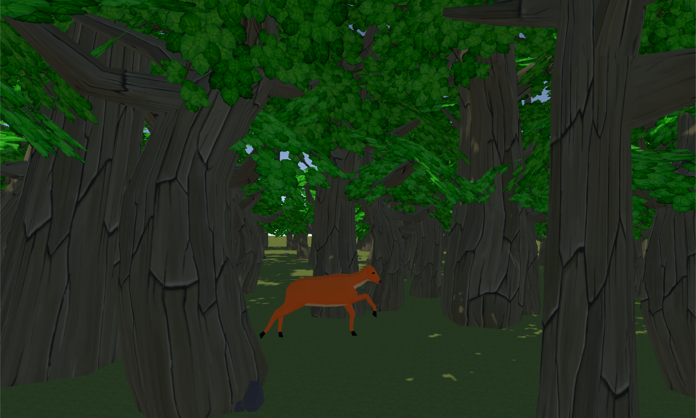
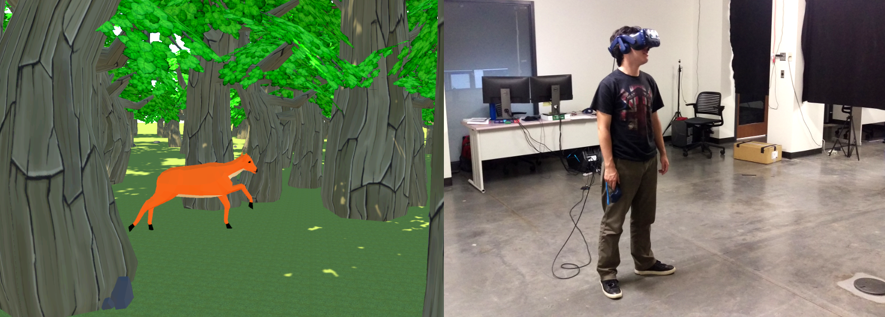
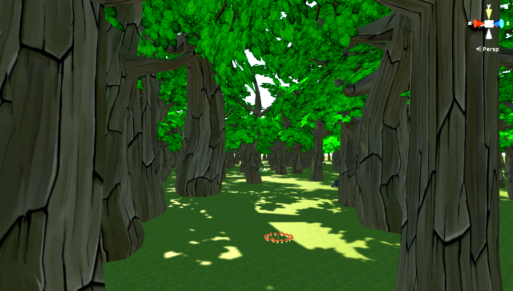

# Redirected-Walking-Thresholds
Code for a virtual reality experiment designed to measure the imperceptibility of redirected walking gains

This is part of a research study that measured RDW rotation thresholds considering different conditions including FOV, disrtactor presence, gender, and simulator sickness.
This work is a collaboration between Niall Williams and Dr. Tabitha Peck.
The paper summarizing our results has been accepted for publication to a top VR journal, IEEE TVCG. It is currently under revision.

### Images
Some screenshots of the experiment are below. I also hosted the slides I presented on my website. These slides can be found [here](https://niwilliams.com/projects/RDW_Slides.pptx).

Comparison of 110 FOV and 40 FOV.

 

The distractor in our experiment was a running deer.

 

A participant during the experiment.

 

The virtual environment participants were placed in.

 

